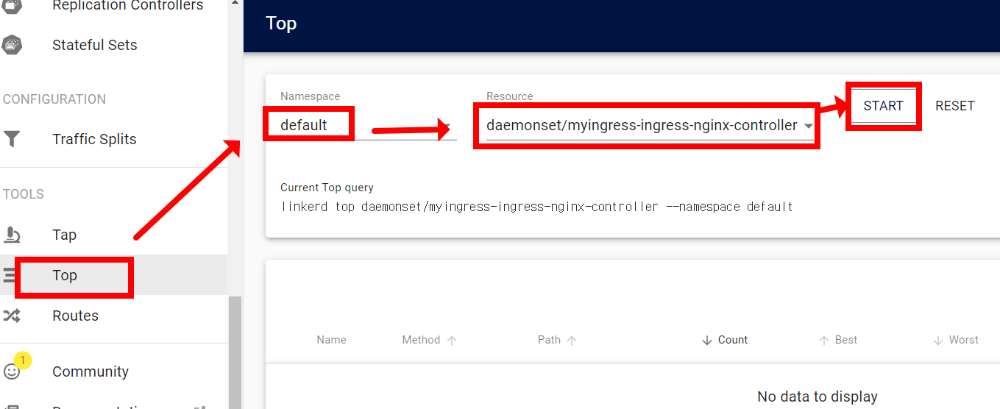

# Exercise 11.2


1.helm 을 이용하여 ingress 검색
```
helm search hub ingress
```

##

2.nginx ingress 챠트 레포지토리 추가
```
helm repo add ingress-nginx https://kubernetes.github.io/ingress-nginx
```

##

3.repo 업데이트
```
helm repo update
```

##

4.yaml을 다운로드 하고, Daemonset으로 변경
```
helm fetch ingress-nginx/ingress-nginx --untar
```
```
cd ingress-nginx
vi values.yaml
```
약 190 라인
```
# -- Use a `DaemonSet` or `Deployment`
kind: DaemonSet   # <-----이 부분 수정 (대소문자 유의)
# -- Annotations to be added to the controller Deployment or DaemonSet
```

##

5.helm 챠트를 사용하여 컨트롤러 설치
```
helm install myingress .
```

##

6.설치 확인
```
kubectl get ingress --all-namespaces
kubectl get pod --all-namespaces | grep nginx
```

Pod 가 Running 상태가 되면 다음 단계로 진행

##

7.ingress 규칙 생성
```
cat <<EOF | kubectl apply -f -
apiVersion: networking.k8s.io/v1
kind: Ingress
metadata:
  name: ingress-test
  annotations:
    kubernetes.io/ingress.class: "nginx"
spec:
  rules:
  - host: www.external.com
    http:
      paths:
      - backend:
          service:
            name: web-one
            port:
              number: 80
        path: /
        pathType: ImplementationSpecific
status:
  loadBalancer: {}
EOF
```

##

8.ingress, Pod 확인
```
kubectl get ingress
kubectl get pod -o wide | grep myingress
```

##

9.8에서 확인한 Pod의 노드 ip로 curl
```
curl <node ip>
```

##

10.svc 확인
```
kubectl get svc | grep ingress
```
##

11.10에서 확인한 svc의 ip로 curl
```
curl <svc ip>
```

##

12.ingress의 url 로 curl
```
curl -H "Host: www.external.com" http://<10에서 확인한 svc ip>
```

##

13.Linkerd 의 ingress pod에 annotation 추가
```
kubectl get ds myingress-ingress-nginx-controller -o yaml  | linkerd inject --ingress - | kubectl apply -f -
```

##

14.linkerd 대시보드에서 Top - Default 네임스페이스 선택 - daemonset/myingress-ingress-nginx-controller 선택 - start 버튼 클릭



##

15.데모 애플리케이션 배포
```
cat <<EOF | kubectl create -f -
apiVersion: apps/v1
kind: Deployment
metadata:
  name: web-one
  labels:
    app: web-one
spec:
  selector:
    matchLabels:
      app: web-one
  replicas: 1
  template:
    metadata:
      labels:
        app: web-one
    spec:
      containers:
      - image: nginx
        name: nginx
        ports:
        - containerPort: 80
---
apiVersion: v1
kind: Service
metadata:
  name: web-one
spec:
  type: ClusterIP
  selector:
    app: web-one
  ports:
    - port: 80
EOF
```

##

16.생성된 web-one pod로 접속
```
kubectl exec -it <위에서 생성한 Pod name> -- /bin/bash
```

##

17.웹서버 간단 구성
```
apt-get update
apt-get install vim -y
vi /usr/share/nginx/html/index.html
```

index.html 내용작성

```
<!DOCTYPE html> <html>
<head>
<title>Internal Welcome Page</title>  #<-- 해당라인 편집   
<style>
<output_omitted>
```

pod 접속해제
```
exit
```

##

17.ingress 편집
```
kubectl edit ingress ingress-test
```

```
spec:
  rules:
  - host: internal.org      #<-- 해당 라인 변경
    http:
```

##

18.curl 테스트
```
curl -H "Host: internal.org" http://<ingress controller svc ip>/
```

또는
```
curl -H "Host: internal.org" \
$(kubectl get svc myingress-ingress-nginx-controller -o=jsonpath='{.spec.clusterIP}')
```
