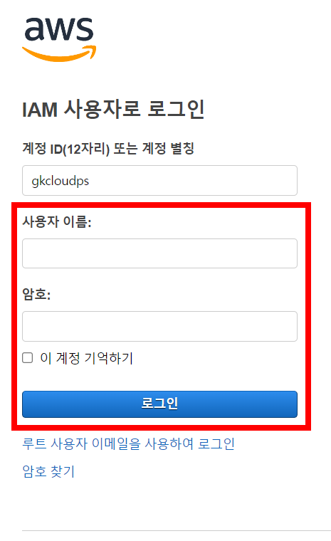
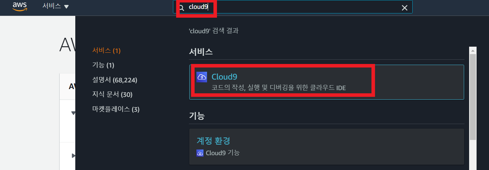
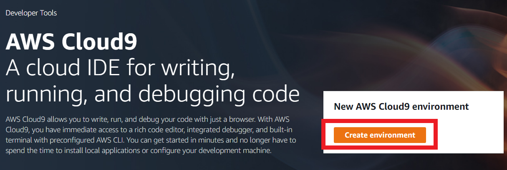
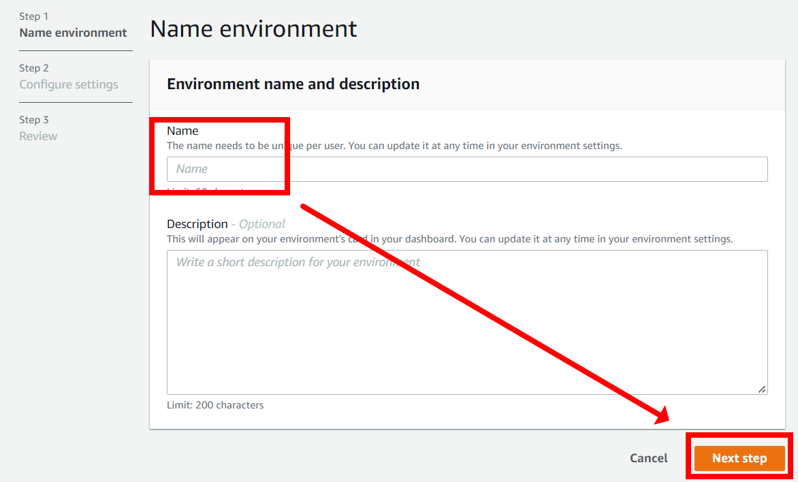
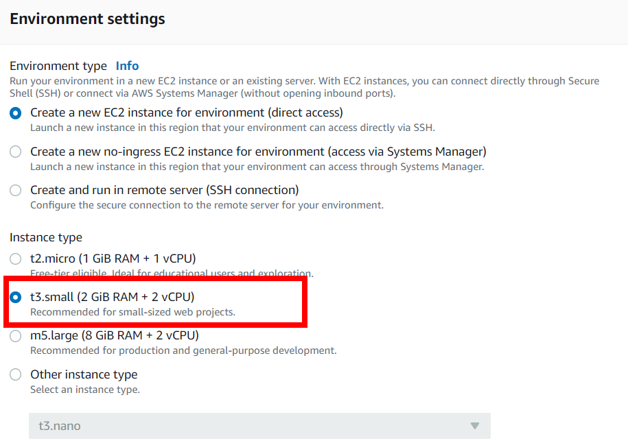
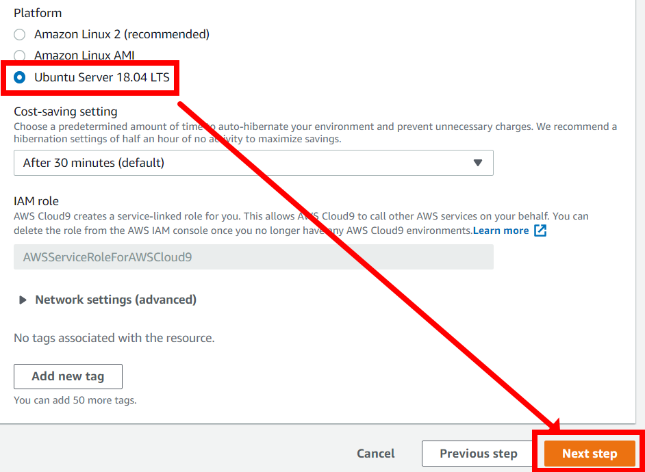
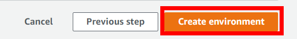
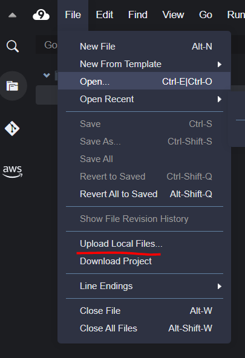
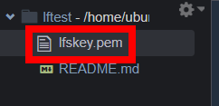
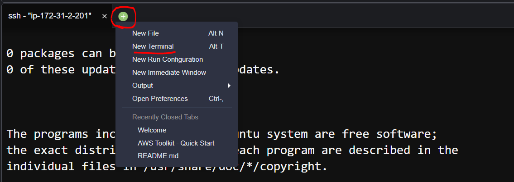

# Exercise 3.0 - presetting

> 실습환경 - AWS EC2 가상머신 환경으로 구성

Control Plane (Master Node)

```
OS : Ubuntu 22.04
vCPU : 2
Memory : 8G
HDD or SSD : 20G
```

Data Plane (Worker Node)

```
OS : Ubuntu 22.04
vCPU : 2
Memory : 8G
HDD or SSD : 20G
```

##

> 실습 자료 (YAML)

```
다운로드 경로 : https://training.linuxfoundation.org/cm/LFS458
user : LFtraining
password : Penguin2014

또는 강사가 제공하는 파일 다운로드
```

##

> Workspace 셋팅

1.제공된 계정으로 AWS 로그인

```
aws 접속 링크 :
https://gkcloudps.signin.aws.amazon.com/console
```



##

2.상단 검색창에 Cloud9 을 검색하고 Cloud9 서비스를 클릭



##

3.Create environment 를 클릭



##

4.Name란에 본인의 계정명을 입력하고 Next step 을 클릭



##

5.아래 스크린샷 처럼 t3.small, ubuntu 18.04 를 선택하고 Next step 을 클릭





##

6.입력한 내용을 다시 검토 후 Create environment 를 클릭



##

7.제공받은 pem 파일을 Cloud 환경에서 좌측상단 File - Upload Local Files 를 클릭하여 해당 파일을 업로드





##

8.해당명령으로 key 파일의 권한을 변경

```
chmod 600 LFS458.pem
```

##

9.해당 명령으로 CP 노드에 접속

```
ssh -i LFS458.pem <CP IP>
```

##

10.해당 명령으로 hostname 변경

```
sudo -i
sudo hostnamectl set-hostname cp
sudo -i
```

##

11.+버튼을 클릭하고 터미널을 새로 엽니다.



##

12.해당 명령으로 Worker 노드에 접속

```
ssh -i LFS458.pem <worker ip>
```

##

13.해당 명령으로 hostname 변경

```
sudo -i
sudo hostnamectl set-hostname worker
sudo -i
```
