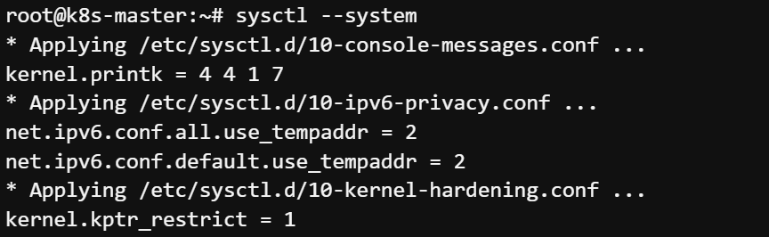

# Exercise 3.1 - Install Kubernetes

> Control Plane 에서 진행

1.root 사용자로 변경

```
sudo -i
```

##

2.패키지도구(apt) 업데이트

```
apt-get update && apt-get upgrade -y
```

##

3.종속성을 보장하기 위해 필요 패키지 설치

```
apt install curl apt-transport-https vim git wget gnupg2 software-properties-common apt-transport-https ca-certificates uidmap lsb-release -y
```

##

4.스왑 비활성화

```
swapoff -a
```

##

5.모듈 로드

```
modprobe overlay
modprobe br_netfilter
```

##

6.필요한 트래픽을 허용하도록 커널 네트워킹을 업데이트

```
cat << EOF | tee /etc/sysctl.d/kubernetes.conf
net.bridge.bridge-nf-call-ip6tables = 1
net.bridge.bridge-nf-call-iptables = 1
net.ipv4.ip_forward = 1
EOF
```

##

7.변경 내용이 현재 커널에서도 사용되는지 확인

```
sysctl --system
```



이하 생략

##

8.containerd 설치
```
sudo mkdir -p /etc/apt/keyrings
curl -fsSL https://download.docker.com/linux/ubuntu/gpg | sudo gpg --dearmor -o /etc/apt/keyrings/docker.gpg

echo "deb [arch=$(dpkg --print-architecture) signed-by=/etc/apt/keyrings/docker.gpg] https://download.docker.com/linux/ubuntu $(lsb_release -cs) stable" | sudo tee /etc/apt/sources.list.d/docker.list > /dev/null

apt-get update && apt-get install containerd.io -y
containerd config default | tee /etc/containerd/config.toml
systemctl restart containerd
```

##

9.apt-get 레포지토리 추가

```
cat <<EOF >/etc/apt/sources.list.d/kubernetes.list
deb http://apt.kubernetes.io/ kubernetes-xenial main
EOF
```

##

10.패키지에 대한 GPG 키를 추가

```
curl -s \
https://packages.cloud.google.com/apt/doc/apt-key.gpg \ | apt-key add -
```

##

11.apt-get 업데이트

```
apt-get update
```

##

12.kubernetes 소프트웨어 설치 (이후 랩에서 최신버전으로 업데이트 예정)

```
apt-get install -y kubeadm=1.24.1-00 kubelet=1.24.1-00 kubectl=1.24.1-00
```

##

13.설치한 kubernetes 소프트웨어 holding
```
apt-mark hold kubelet kubeadm kubectl
```

##

14.CP 서버의 IP주소 확인

```
hostname -i
```

##

15./etc/hosts 업데이트

```
echo <CP IP> k8scp >> /etc/hosts
```

##

16.kubeadm-config.yaml 파일 생성

```
cat << EOF > kubeadm-config.yaml
apiVersion: kubeadm.k8s.io/v1beta3
kind: ClusterConfiguration
kubernetesVersion: 1.24.1
controlPlaneEndpoint: "k8scp:6443"
networking:
  podSubnet: 172.16.0.0/16
EOF
```

##

17.CP 초기화

```
kubeadm init --config=kubeadm-config.yaml --upload-certs \
| tee kubeadm-init.out
```
>Container Runtime 동작에러발생시 
```
sed -i '/"cri"/ s/^/#/' /etc/containerd/config.toml
```

##

18.일반 유저(ubuntu)로 변환

```
exit
```

##

19.kubeconfig 파일 생성 및 설정

```
mkdir -p $HOME/.kube
sudo cp -i /etc/kubernetes/admin.conf $HOME/.kube/config
sudo chown $(id -u):$(id -g) $HOME/.kube/config
```

##

20.Flannel 네트워크 플러그인 설치
```
kubectl create -f https://raw.githubusercontent.com/wsjang619/k8s_course/master/lab1/yaml/flannel.yaml
```

참고링크 : https://github.com/flannel-io/flannel


##

21.kubectl 명령어 자동완성 기능 설정

```
sudo apt-get install bash-completion -y
```

```
source <(kubectl completion bash)
echo "source <(kubectl completion bash)" >> ~/.bashrc
source /etc/bash_completion
echo alias k=kubectl >> ~/.bashrc
source ~/.bashrc
complete -F __start_kubectl k
```
