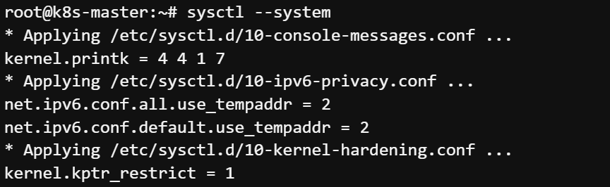

# Exercise 3.2


> Worker Node 에서 진행

1.root 사용자로 변경

```
sudo -i
```
##

2.패키지도구(apt) 업데이트

```
apt-get update && apt-get upgrade -y
```
##

3.종속성을 보장하기 위해 필요 패키지 설치

```
apt install curl apt-transport-https vim git wget gnupg2 software-properties-common apt-transport-https ca-certificates uidmap -y
```
##

4.스왑 비활성화

```
swapoff -a
```
##

5.모듈 로드

```
modprobe overlay
modprobe br_netfilter
```
##

6.필요한 트래픽을 허용하도록 커널 네트워킹을 업데이트

```
cat << EOF | tee /etc/sysctl.d/kubernetes.conf
net.bridge.bridge-nf-call-ip6tables = 1
net.bridge.bridge-nf-call-iptables = 1
net.ipv4.ip_forward = 1
EOF
```
##

7.변경 내용이 현재 커널에서도 사용되는지 확인

```
sysctl --system
```


이하 생략
##

8.소프트웨어 설치에 필요한 키 설치

```
curl -fsSL https://download.docker.com/linux/ubuntu/gpg | sudo apt-key add -
```

##

9.Containerd 설치

```
apt install containerd -y
```

##

10.apt-get 레포지토리 추가

```
cat <<EOF >/etc/apt/sources.list.d/kubernetes.list
deb http://apt.kubernetes.io/ kubernetes-xenial main
EOF
```

##

11.패키지에 대한 GPG 키를 추가

```
curl -s \
https://packages.cloud.google.com/apt/doc/apt-key.gpg \ | apt-key add -
```

##

12.apt-get 업데이트

```
apt-get update
```

##

13.kubernetes 소프트웨어 설치 (이후 랩에서 최신버전으로 업데이트 예정)

```
apt-get install -y kubeadm=1.23.1-00 kubelet=1.23.1-00 kubectl=1.23.1-00
```
```
apt-mark hold kubelet kubeadm kubectl
```

##

14.CP 터미널에서 join 명령어 생성

```
kubeadm token create --print-join-command --ttl 0
```

##

15./etc/hosts 업데이트

```
echo <CP IP> k8scp >> /etc/hosts
```
(CP IP확인 방법 - CP 터미널에서 아래명령 실행)
```
hostname -i
```

##

16.Worker 터미널에서 14 명령어 결과로 나온 명령어를 실행

```
kubeadm join ~~~ 으로 생성됨
```
