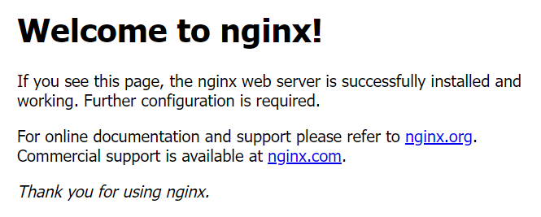

# Exercise 3.5


> Control Plane 에서 진행

1.Pod 확인

```
kubectl get pod
```
##

2.Pod 중 하나를 선택하여 exec 명령으로 Pod 내 printenv 명령 실행

```
kubectl exec <pod name> -- printenv | grep KUBERNETES
```

##

3.nginx svc 삭제
```
kubectl get svc
kubectl delete svc nginx
```

##

4.Loadbalancer 유형의 svc 생성(externalIP는 pending)

```
kubectl expose deployment nginx --type=LoadBalancer
```

##

5.svc 정보를 조회하여 Nodeport 확인 (portnumber:Nodeport/tcp 로 표현됨)
```
kubectl get svc
```

##

6.노드의 Public IP 확인

```
curl ifconfig.io
```

##

7.웹브라우저를 열고 위 Public IP와 NodePort 로 접근 시도
```
<PublicIP>:<NodePort>
```


##

8.Deployment의 replicas를 0 으로 scale
```
kubectl scale deployment nginx --replicas=0
kubectl get pod
```

##

9.웹브라우저에서 새로고침

##

10.Deployment의 replicas를 2로 scale
```
kubectl scale deployment nginx --replicas=2
kubectl get pod
```

##

11.다시 웹브라우저 새로고침하여 웹서버 확인

##

12.Deployment 삭제, Endpoint 삭제, svc 삭제
```
kubectl delete deployment nginx
kubectl delete ep nginx
kubectl delete svc nginx
```
